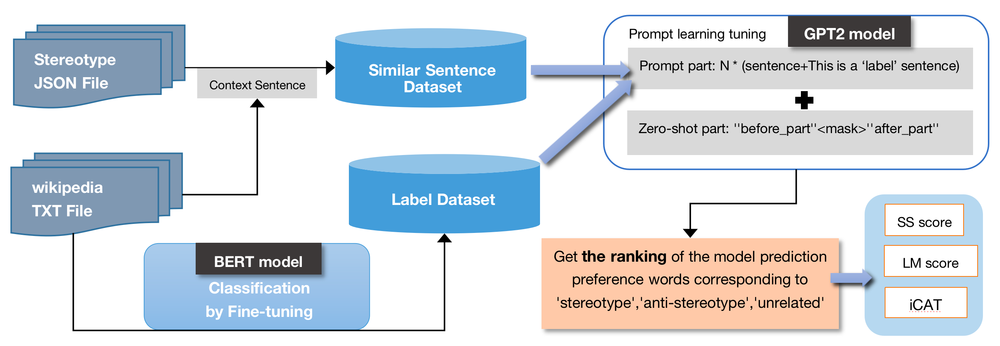

## Introduction

Stereotype bias is a problem that exists in large amounts of text data in reality. In order to avoid the harm that this unfairness may cause, stereotype bias from language models should be mitigate as much as possible. Fine-tuning has been tried to solve the stereotype problem in some research.  
In this project, we proposed prompt learning to correct for stereotype bias in large language models. The stereotype dataset was employed as the foundation for quantifying the model’s bias. We selected some samples from an out-of-corpus Wikipedia dump(8 million text data included) as few-shot prompt examples based on their similarity to the masked sentences. Different numbers of few-shots were input in the format of “sentence and label”as different experimental groups. With such hints, the stereotypes from the language model can be effectively mitigated. Then we found the two-shot model achieved the best language model tuning results.  

## File Structure

### This project includes five main files, each serving a unique purpose:
1. prompt_learning_structrue.py: This file contains the main executable logic and hosts the main utility functions and tools to perform specific tasks.
2. get_save_similar_sentences.py: This is a function file process the few-shot prompt examples collection.
3. produce_sentecnes_withlabel.py: This is a file used to train a classification model using a secondary sorted stereotype data set.
4. produce_sentecnes_withlabel2.py: This is a file of the classification model generated by executing "produce_sentecnes_withlabel.py", which has a function of classifying labels for samples from an out-of-corpus Wikipedia dump.
5. README.md: The file you are currently reading offers detailed information about the project and instructions for use.
   

### By understanding the function of these 5 files, you will have a good grasp of the project's structure and how it operates.

#### In the end, we also provide detailed descirption about this project in my dissertation report, which is publicly avaiable at https://www.dropbox.com/scl/fi/ofpn0fg0st5vvp0uywbc0/Prompt-Learning-to-LLM-s-Mitigate-Stereotypes.pdf?rlkey=abpmac91yrd2xkh62w8oxzgeu&dl=0.
